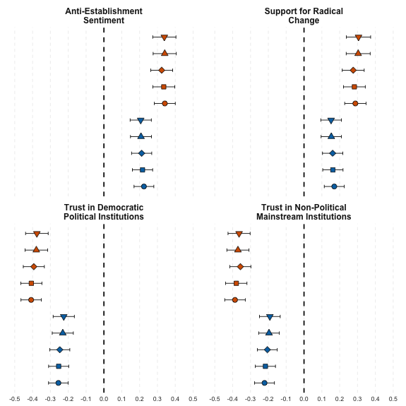
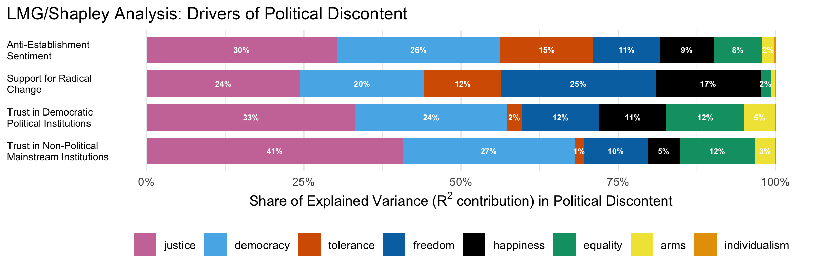
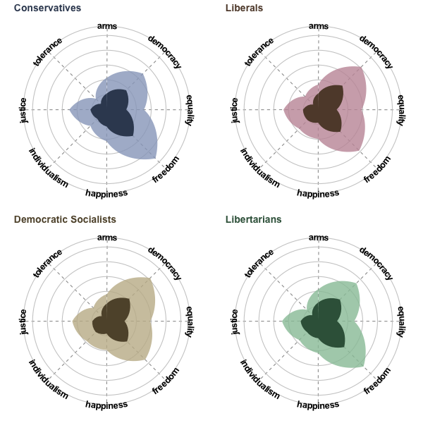
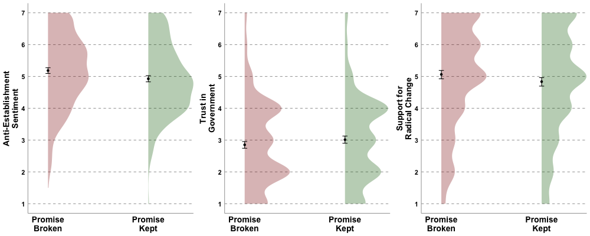

# Problem

<div style="overflow:auto;">


<div style="float:right; clear:right; font-size:0.85em; color:#555; font-style:italic; margin:0 0 1em 1em;">
  Source: Gallup
</div>

<p>
Across the Western world, **political discontent**—disaffection with, distrust in, and alienation from political institutions—has **risen sharply** over the past several decades. In the United States, trust in core governmental institutions has declined steadily since the 1970s: fewer than one-third of Americans report trusting the Supreme Court or the Presidency, and trust in Congress has fallen into the single digits. This long-term trend transcends administrations, parties in power, and short-term political shocks.
</p>
<p>
Although the trend itself is well documented, its **underlying cause remains unclear**. Competing explanations—economic insecurity, political polarization, personality characteristics, and racial tension—often co-occur, making it **difficult to isolate** which factors meaningfully **drive political disaffection** versus merely accompany it.
</p>
<p>
This ambiguity creates a **practical problem** for institutions and policymakers. Without a clear, measurable diagnosis of what is fueling political discontent, **efforts to restore trust or legitimacy are largely misguided**.
</p>
<p>
In this project, I examine whether perceptions of a **broken social contract**—the belief that the government is not living up to the state's founding promise—represent a distinct, measurable, and consequential **driver of political discontent**. Rather than treating this as a purely theoretical construct, I approach it as an applied inference problem:
</p>
<p>
_Can this perception be reliably **detected** at scale, **decomposed** into its key components, and shown to meaningfully **shape political attitudes** under credible identification strategies?_
</p>
<p>
To answer this question, I use a **multi-method** evidence strategy across three nationally representative studies. Together, these analyses combine **large-scale text** data, **causal attribution** techniques, and **experimental variation** to identify the role of social contract perceptions in shaping political discontent.
</p>
</div>

# Executive Summary

  - **Problem:** Political discontent has risen sharply, but existing explanations (ideology, personality, economic hardship) do not fully account for it.
  - **Hypothesis:** Political discontent is driven by the subjective experience of a broken social contract.
  - **Approach:** Three nationally representative U.S. studies using open-text measurement, computational modeling, variance decomposition, and randomized experiments.
  - **Key Findings:**
    - The subjective experience of a broken social contract robustly predicts anti-establishment sentiment, support for radical change, and distrust in institutions.
    - These effects hold after controlling for ideology, personality, socioeconomic factors, and other variables.
    - Violations of justice and democratic representation are the strongest drivers.
    - Experimentally inducing a broken promise causally increases political discontent.
  - **Conclusion:** Political discontent reflects perceived institutional failure; it can be measured, decomposed, and shifted.

# Evidence Strategy

The social contract is an implicit agreement between a state and its citizens: the state promises certain rights and obligations, and citizens, in return, comply with laws, pay taxes, and contribute to the collective. In this project, I operationalize the social contract based on two principles.

First, it is **subjective rather than objective**. Institutional legitimacy depends on citizens’ perceptions of whether the state is fulfilling its obligations, not solely on legal or constitutional interpretations. Accordingly, this project focuses on how people perceive the state’s promise and performance, rather than adjudicating their legal accuracy.

Second, the social contract operates at the level of **guiding values rather than specific policies**. These values are designed to command broad consensus and to guide institutional behavior across administrations, even as policy debates evolve within their boundaries.

A **broken social contract** is therefore defined as the perceived gap between what the state promises *on paper* and what it delivers *in practice*. The central inference challenge is determining whether this perception constitutes a distinct and consequential driver of political discontent—above and beyond alternative explanations—and whether it can be measured, decomposed, and tested using complementary methods. In this project, political discontent is operationalized as anti-establishment sentiment, support for radical change, and distrust in governmental and non-governmental national institutions.

To address this, I use three nationally representative studies, each designed to resolve a different inferential gap while holding the core construct constant:

- **Study 1 — Measurement & Construct Validation:**
    
    Uses open-text responses and computational text analysis to capture how citizens describe the values the state promises versus how it operates in practice, and tests whether divergence between the two uniquely predicts political discontent.
    
- **Study 2 — Driver Attribution:**
    
    Measures perceived government performance on the value dimensions identified in Study 1 to isolate which components of the social contract drive political discontent.
    
- **Study 3 — Sensitivity to Intervention:**
    
    Examines whether political attitudes shift in response to experimentally induced changes in perceived social contract fulfillment.

# Study 1: Measuring the Social Contract

<div style="margin-top: 0;">
  <p style="margin:0 0 12px 0;">
    <a href="https://deanbaltiansky.com/broken-social-contract/studies/study-1/index.html" target="_blank" rel="noopener"
       style="background:#0b69ff;color:white;padding:0.55em 0.9em;border-radius:8px;text-decoration:none;display:inline-block;margin:0;">
      FULL REPORT ↗
    </a>
  </p>
</div>

## Measure

The first challenge in diagnosing political discontent is **measurement**. If perceptions of a broken social contract drive political discontent, they must be captured in a way that reflects how people *intuitively* understand the state’s promise—without imposing researcher-defined categories or policy frames.

Therefore, Study 1 relies on **open-text responses combined with participant-defined priorities**. Participants listed the values the United States stands for *on paper* (what is promised) and *in practice* (what is delivered). For each set, they then allocated a fixed budget of points across their listed values to indicate **how important each value is** to the United States.

Written responses were embedded in high-dimensional semantic space, and participant-assigned importance weights were used to compute **priority-weighted representations** of the social contract *on paper* and *in practice*. The perceived breach of the social contract is operationalized as the semantic distance between these two weighted representations: larger distances indicate greater perceived divergence between promise and delivery. Technically, this distance is computed as one minus the cosine similarity between the weighted semantic representations of the two value sets.

## Predictive Validity

At a descriptive level, a broken social contract is associated with different dimensions of political discontent: It is positively associated with anti-establishment sentiment (*r* = .23) and support for radical change (*r* = .17), and negatively associated with trust in governmental institutions (*r* = -.26) and non-governmental national institutions (*r* = -.22).

<div style="margin-top: 0;">
  <p style="margin:0 0 12px 0;">
    <a href="https://deanbaltiansky.com/broken-social-contract/studies/study-1/app/index.html" target="_blank" rel="noopener"
       style="background:#0b69ff;color:white;padding:0.55em 0.9em;border-radius:8px;text-decoration:none;display:inline-block;margin:0;">
      INTERACTIVE CORRELATIONS EXPLORER ↗
    </a>
  </p>
</div>

The central question is whether these relationships reflect a distinct construct, rather than a proxy for ideology, personality, or demographic composition, and whether it uniquely predicts political discontent over and above these related constructs. To that end, I insert the following control variables to multilevel linear regression models: Political ideology, social dominance orientation, agreeableness, gender, race, ethnicity, income, education, age, county median income, county inequality, and county density.

In fully controlled multilevel models, a one standard deviation increase in a broken social contract predicts a:

  - **0.21 SD increase** in anti-establishment sentiment (95% CI = [0.15, 0.26])
  - **0.15 SD increase** in support for radical change (95% CI = [0.10, 0.21])
  - **0.23 SD decrease** in trust in governmental institutions (95% CI = [-0.29, -0.17])
  - **0.20 SD decrease** in trust in non-governmental national institutions (95% CI = [-0.25, -0.14])

<div>
  <p style="margin:0;">
    <a href="https://deanbaltiansky.com/broken-social-contract/studies/study-1/lm-table-app/index.html" target="_blank" rel="noopener"
       style="background:#0b69ff;color:white;padding:0.55em 0.9em;border-radius:8px;text-decoration:none;display:inline-block;margin:0;">
      EXPLORE MODEL ROBUSTNESS ↗
    </a>
  </p>
</div>

The specification curve below summarizes this robustness across alternative model assumptions. Rather than relying on a single preferred specification, this approach demonstrates that the relationship between a broken social contract and political discontent is directionally consistent and substantively meaningful across reasonable analytic choices.

```{=html}
<div style="display:flex; align-items:center; gap:20px; margin:16px 0 24px;">
  <!-- Left column: figure -->
  <div style="flex:0 0 50%;">
    
  </div>

  <!-- Right column: text + legend -->
  <div style="flex:1; font-size:0.9em; color:#333;">
    <p><strong>Specification Curve: Linear models of Studies 1 and 2.</strong> 
      The figure shows the standardized beta coefficients of a broken social contract on anti-establishment sentiment, support for radical change, trust in governmental institutions, trust in non-governmental national institutions. The specification curve demonstrates the robustness of the effect, controlling for a wide variety of covariates (see legend below), all of which have been shown in the past to predict important political attitudes outcomes. Error bars represent 95% confidence intervals.
    </p>

    <!-- Legend -->
    <div style="
      display:flex;
      flex-wrap:wrap;
      gap:20px;
      font-size:14px;
      line-height:1.8;
      margin-top:12px;
    ">
      <!-- Left: outline shapes -->
      <div style="flex:1 1 220px; min-width:200px;">
        <div>
          <svg width="16" height="16" style="vertical-align:middle; margin-right:8px;">
            <circle cx="8" cy="8" r="6" fill="none" stroke="#000" stroke-width="2"/>
          </svg>
          No controls
        </div>
        <div>
          <svg width="16" height="16" style="vertical-align:middle; margin-right:8px;">
            <rect x="3" y="3" width="10" height="10" fill="none" stroke="#000" stroke-width="2"/>
          </svg>
          Conservatism + SDO
        </div>
        <div>
          <svg width="16" height="16" style="vertical-align:middle; margin-right:8px;">
            <rect x="3" y="3" width="10" height="10" fill="none" stroke="#000" stroke-width="2"
                  transform="rotate(45 8 8)"/>
          </svg>
          Conservatism + SDO + Agreeableness
        </div>
        <div>
          <svg width="16" height="16" style="vertical-align:middle; margin-right:8px;">
            <polygon points="8,2 14,14 2,14" fill="none" stroke="#000" stroke-width="2"/>
          </svg>
          Conservatism + SDO + Agreeableness + Demographics
        </div>
        <div>
          <svg width="16" height="16" style="vertical-align:middle; margin-right:8px;">
            <polygon points="2,2 14,2 8,14" fill="none" stroke="#000" stroke-width="2"/>
          </svg>
          Conservatism + SDO + Agreeableness + Demographics + County measures
        </div>
      </div>

      <!-- Right: color swatches -->
      <div style="flex:1 1 120px; min-width:100px;">
        <div>
          <span style="display:inline-block; width:14px; height:14px; background:#0072B2; margin-right:8px; vertical-align:middle;"></span>
          Study 1
        </div>
        <div>
          <span style="display:inline-block; width:14px; height:14px; background:#D55E00; margin-right:8px; vertical-align:middle;"></span>
          Study 2
        </div>
      </div>
    </div>
  </div>
</div>
```
## Dimension Reduction

While open-text responses provide a high-fidelity measure of how people intuitively understand the social contract, they are not directly suited for isolating the **shared value dimensions** that structure these perceptions across individuals. To move from individual language to a common, interpretable representation, this step focuses on identifying the core values that people believe guide the United States on paper.

To do so, I applied **k-means clustering** to the embedded representations of participants’ open-text responses describing the values the U.S. stands for on paper. This data-driven approach reduces high-dimensional semantic information into a small number of interpretable clusters, while remaining agnostic to researcher-imposed categories.

The resulting eight-cluster solution captures the dominant value dimensions implicitly associated with the U.S. social contract:

  - Democracy
  - Equality
  - Freedom
  - Individualism
  - Justice
  - Pursuit of happiness
  - Right to bear arms
  - Tolerance

The figure below shows the cluster structure, along with the most frequently mentioned values within each cluster. These value dimensions provide an interpretable and scalable representation of the social contract and form the basis for targeted measurement and attribution in Study 2.

<table width="100%" style="border-collapse:collapse; table-layout:fixed;">
  <tr style="vertical-align:top;">
    <!-- Left column: image -->
    <td style="width:35%; padding:0 8px 0 0; vertical-align:top;">
      
    </td>

    <!-- Right column: table -->
    <td style="width:65%; padding:0 0 0 8px; vertical-align:top;">
      <table style="border-collapse:collapse; width:100%; font-size:0.75em; text-align:left; word-wrap:break-word; overflow-wrap:break-word;">
        <tr style="background:#f2f2f2; font-weight:bold;">
          <th style="border:1px solid #ddd; padding:3px; vertical-align:top; text-align:left;">
            
            Pursuit of happiness
          </th>
          <th style="border:1px solid #ddd; padding:3px; vertical-align:top; text-align:left;">
            
            Individualism
          </th>
          <th style="border:1px solid #ddd; padding:3px; vertical-align:top; text-align:left;">
            
            Democracy
          </th>
          <th style="border:1px solid #ddd; padding:3px; vertical-align:top; text-align:left;">
            
            Equality
          </th>
          <th style="border:1px solid #ddd; padding:3px; vertical-align:top; text-align:left;">
            
            Right to bear arms
          </th>
          <th style="border:1px solid #ddd; padding:3px; vertical-align:top; text-align:left;">
            
            Freedom
          </th>
          <th style="border:1px solid #ddd; padding:3px; vertical-align:top; text-align:left;">
            
            Tolerance
          </th>
          <th style="border:1px solid #ddd; padding:3px; vertical-align:top; text-align:left;">
            
            Justice
          </th>
        </tr>

        <tr>
          <td style="border:1px solid #ddd; padding:3px;">opportunity (87)</td>
          <td style="border:1px solid #ddd; padding:3px;">independence (143)</td>
          <td style="border:1px solid #ddd; padding:3px;">democracy (294)</td>
          <td style="border:1px solid #ddd; padding:3px;">equality (398)</td>
          <td style="border:1px solid #ddd; padding:3px;">right to bear arms (49)</td>
          <td style="border:1px solid #ddd; padding:3px;">freedom (505)</td>
          <td style="border:1px solid #ddd; padding:3px;">diversity (59)</td>
          <td style="border:1px solid #ddd; padding:3px;">justice (223)</td>
        </tr>

        <tr>
          <td style="border:1px solid #ddd; padding:3px;">pursuit of happiness (85)</td>
          <td style="border:1px solid #ddd; padding:3px;">individualism (58)</td>
          <td style="border:1px solid #ddd; padding:3px;">limited government (23)</td>
          <td style="border:1px solid #ddd; padding:3px;">justice for all (20)</td>
          <td style="border:1px solid #ddd; padding:3px;">right to vote (37)</td>
          <td style="border:1px solid #ddd; padding:3px;">liberty (285)</td>
          <td style="border:1px solid #ddd; padding:3px;">fairness (51)</td>
          <td style="border:1px solid #ddd; padding:3px;">life (54)</td>
        </tr>

        <tr>
          <td style="border:1px solid #ddd; padding:3px;">happiness (33)</td>
          <td style="border:1px solid #ddd; padding:3px;">individuality (15)</td>
          <td style="border:1px solid #ddd; padding:3px;">rule of law (21)</td>
          <td style="border:1px solid #ddd; padding:3px;">equal rights (16)</td>
          <td style="border:1px solid #ddd; padding:3px;">rights (28)</td>
          <td style="border:1px solid #ddd; padding:3px;">freedom of speech (196)</td>
          <td style="border:1px solid #ddd; padding:3px;">religion (25)</td>
          <td style="border:1px solid #ddd; padding:3px;">unity (45)</td>
        </tr>

        <tr>
          <td style="border:1px solid #ddd; padding:3px;">capitalism (31)</td>
          <td style="border:1px solid #ddd; padding:3px;">self-determination (10)</td>
          <td style="border:1px solid #ddd; padding:3px;">checks and balances (13)</td>
          <td style="border:1px solid #ddd; padding:3px;">equality for all (16)</td>
          <td style="border:1px solid #ddd; padding:3px;">individual rights (24)</td>
          <td style="border:1px solid #ddd; padding:3px;">freedom of religion (137)</td>
          <td style="border:1px solid #ddd; padding:3px;">honesty (22)</td>
          <td style="border:1px solid #ddd; padding:3px;">peace (28)</td>
        </tr>

        <tr>
          <td style="border:1px solid #ddd; padding:3px;">hard work (28)</td>
          <td style="border:1px solid #ddd; padding:3px;">sovereignty (8)</td>
          <td style="border:1px solid #ddd; padding:3px;">separation of powers (9)</td>
          <td style="border:1px solid #ddd; padding:3px;">equal opportunity (9)</td>
          <td style="border:1px solid #ddd; padding:3px;">human rights (17)</td>
          <td style="border:1px solid #ddd; padding:3px;">free speech (55)</td>
          <td style="border:1px solid #ddd; padding:3px;">integrity (21)</td>
          <td style="border:1px solid #ddd; padding:3px;">progress (24)</td>
        </tr>
      </table>
    </td>
  </tr>
</table>

# Study 2: Decomposing the Guiding Values in the Social Contract

<div style="margin-top: 0;">
  <p style="margin:0 0 12px 0;">
    <a href="https://deanbaltiansky.com/broken-social-contract/studies/study-2/index.html" target="_blank" rel="noopener"
       style="background:#0b69ff;color:white;padding:0.55em 0.9em;border-radius:8px;text-decoration:none;display:inline-block;margin:0;">
      FULL REPORT ↗
    </a>
  </p>
</div>

Study 1 establishes that a broken social contract robustly predicts political discontent. Study 2 asks which components of the social contract drive this relationship—specifically, which parts of the broken social contract are most predictive of different elements of political discontent.

## Measure

Building on the value dimensions identified in Study 1, participants evaluated the U.S. government along eight core values: democracy, equality, freedom, individualism, justice, pursuit of happiness, right to bear arms, and tolerance. Participants first indicated how important each of the eight core values is to the United States **on paper** using a forced prioritization that summed to 100. They then rated how well the U.S. government delivers on each value **in practice** on a 0–100 scale.

To construct a **broken promise score**, perceived delivery ratings were weighted by each participant’s perceived priorities and aggregated into a single priority-weighted measure of overall delivery. This aggregate score was then reverse-scored so that higher values indicate greater perceived violation of the social contract. Substantively, this approach ensures that broken promises of highly prioritized values contribute more to the overall score than shortfalls on peripheral values.

## Predictive Validity

First, the value-based measure produces the Study 1 patterns at larger magnitudes. With the same control variables as in Study 1, I find that a one standard deviation increase in the broken promise score predicts a:

  - **0.34 SD increase** in anti-establishment sentiment (95% CI = [0.27, 0.40])
  - **0.30 SD increase** in support for radical change (95% CI = [0.24, 0.37])
  - **0.38 SD decrease** in trust governmental institutions (95% CI = [-0.44, -0.31])
  - **0.37 SD decrease** in trust in non-governmental national institutions (95% CI = [-0.43, -0.30])
  
<div>
  <p style="margin:0;">
    <a href="https://deanbaltiansky.com/broken-social-contract/studies/study-2/lm-table-app/index.html" target="_blank" rel="noopener"
       style="background:#0b69ff;
              color:white;
              padding:0.55em 0.9em;
              border-radius:8px;
              text-decoration:none;
              display:inline-block;
              margin:8px 0;">
      EXPLORE MODEL ROBUSTNESS ↗
    </a>
  </p>
</div>

## Drivers of Political Discontent

The central goal of Study 2 is attribution: isolating which value violations account for political discontent. Because the value dimensions are correlated, simple regression coefficients are insufficient. To address this, I decomposed the explained variance using an **LMG Shapley decomposition**, which isolates the unique contribution of each value dimension. The robustness of these patterns was validated with ridge and lasso regressions as well (see Full Report).

Across methods, violations of justice and democracy consistently account for the largest share of the different elements of political discontent. Additionally, (1) anti-establishment sentiment is driven by violations of tolerance; (2) support for radical change is driven by violations of freedom; and (3) trust in both type of institutions is driven by violations of equality.

<div style="padding:12px 0;">
  
</div>

## Heterogeneity in Social Contracts

```{=html}
<div style="display:flex; gap:20px; align-items:center; flex-wrap:wrap; margin:16px 0 24px;">

  <!-- Left: text -->
  <div style="flex:1 1 340px; min-width:260px; font-size:0.95em; color:#333;">
    <p>Study 2 also reveals meaningful differences in how the social contract is understood across population segments. Individuals with different ideological orientations prioritize different values and perceive different patterns of delivery. The visualization contrasts perceived promises (on paper) with perceived performance (in practice), illustrating that there is no single, uniform social contract. In the Cross-Sections app at the right, you can break the data along big five personality traits, party affiliation, education, income, age, race, gender, region, and state.</p>
  </div>

  <!-- Middle: image -->
  <div style="flex:2 1 300px; min-width:300px;">
    
  </div>

  <!-- Right: button -->
  <div style="flex:0 1 180px; min-width:160px; margin-left:auto; text-align:right; white-space:nowrap;">
    <p style="margin:0;">
      <a href="https://deanbaltiansky.com/broken-social-contract/studies/study-2/different-contracts-app/index.html" target="_blank" rel="noopener"
         style="background:#0b69ff; color:#fff; padding:0.55em 0.9em; border-radius:8px; text-decoration:none; display:inline-block; margin:8px 0; text-align:center;">
        EXPLORE CROSS-SECTIONS ↗
      </a>
    </p>
  </div>

</div>


```

# Study 3: Shifting Perceptions of the Social Contract via Randomized Intervention

<div style="margin-top: 0;">
  <p style="margin:0 0 12px 0;">
    <a href="https://deanbaltiansky.com/broken-social-contract/studies/study-3/index.html" target="_blank" rel="noopener"
       style="background:#0b69ff;color:white;padding:0.55em 0.9em;border-radius:8px;text-decoration:none;display:inline-block;margin:0;">
      FULL REPORT ↗
    </a>
  </p>
</div>

Unlike Studies 1 and 2, which rely on observational variation, Study 3 uses random assignment to isolate the effect of a broken social contract on political discontent. This design was selected through a competitive peer-reviewed process by the Time-sharing Experiments for the Social Sciences (TESS) program, enabling implementation on NORC’s nationally representative AmeriSpeak panel.

## Experimental Design

In a nationally representative sample of ~1800 American adults, participants were randomly assigned to one of three conditions: *Promise Kept*, *Promise Broken*, or *Control*.

To ground the manipulation in participants’ own value systems, individuals first identified the single value they believed is most central to the U.S. social contract. That value was then embedded into the experimental prompt:

  - **Promise Kept**: Reflect on how the U.S. *IS* living up to this value's promise
  - **Promise Broken**: Reflect on how the U.S. *IS NOT* living up to this value's promise
  - **Control**: Define this value
  
Therefore, across conditions, the same value was referenced, holding value priming constant; only the framing of the prompt varied, isolating the causal effect of reflecting on a kept versus broken institutional promise.

After the manipulation, participants reported anti-establishment sentiment, trust in government, and support for radical political change.

## Causal Effects on Political Discontent

Participants in the *Promise Broken* condition consistently expressed higher political discontent that those in the *Promise Kept* condition. Specifically, relative to the *Promise Kept* condition, participants primed to reflect on a broken promise reported:

  - **Higher anti-establishment sentiment** (0.26-point increase on a 7-point scale; *t*(1158.9) = 3.92, *p* < .001, 95% CI [0.12, 0.39], *d* = 0.23)
  - **Lower trust in government** (0.16-point decrease on a 7-point scale; *t*(1153.65) = -2.03, *p* = .043, 95% CI [-0.32, -0.01], *d* = -0.12)
  - **Higher support for radical change** (0.23 increase on a 7-point scale; *t*(1148.6) = 2.34, *p* = .019, 95% CI [0.04, 0.42], *d* = 0.14)

<div style="padding:12px 0;">
  
</div>

Comparisons with the control condition indicate that these effects are primarily driven by increased discontent in the Promise Broken condition, rather than reduced discontent in the Promise Kept condition.

# Implications for Organizations and Policy

  - **People are attuned to gaps between promise and outcomes.** Organizations should actively track whether stakeholders believe the institution is living up to its core stated values, not just whether outcomes are achieved.
  - **Trust requires substantive delivery, not surface-level fixes.** Restoring trust demands material follow-through on institutional promises, not symbolic gestures or messaging alone.
  - **Not all social contracts are created equal.** Because perceptions of institutional promises vary across groups, effective interventions must account for differences in what people believe was promised—and what they believe was delivered.